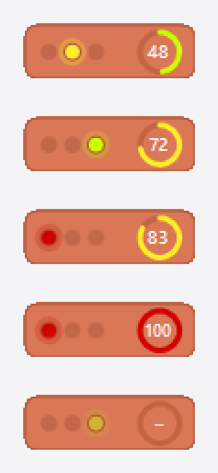
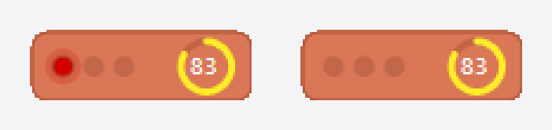
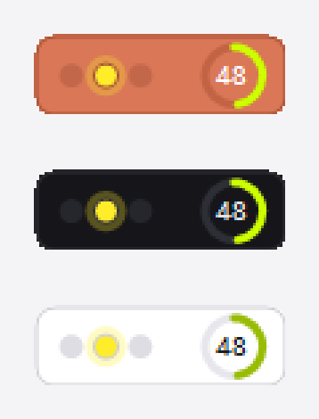

# Claude Semáforo

Uma barrinha que fica num canto da tela e responde, sem você precisar procurar: **o
Claude está trabalhando, terminou, ou está parado esperando você responder?**



De cima para baixo, é isso que cada uma quer dizer:

| A barra mostra | Significa |
|---|---|
| 🟡 **luz amarela acesa** | o Claude está trabalhando agora |
| 🟢 **luz verde** | terminou — a resposta está lá esperando você ler |
| 🔴 **luz vermelha piscando** | **parou e precisa de você**: uma autorização ou uma pergunta |
| 🔴 **luz vermelha fixa** | bateu no limite de uso; não dá para continuar até o horário de reset |
| ⚪ **luz fraca, sem brilho** | nenhuma conversa aberta; mostra como a última terminou |

O **círculo da direita** é quanto você já gastou da sua janela de 5 horas de uso — o
mesmo número que aparece no `/usage` dentro do Claude. Ele fica verde, passa a amarelo e
termina em vermelho conforme enche.

Com várias conversas abertas ao mesmo tempo, a que **precisa de você** aparece na frente
das outras — é a única que fica parada até alguém responder.

### Quando o Claude precisa de você, a luz pisca



A luz vermelha pisca **até você responder**, e para sozinha assim que você responde. É a
diferença entre ela e o vermelho do limite, que fica fixo.

### Três cores, à sua escolha



Claude (o laranja da marca), Escuro e Claro. Troque no menu do botão direito.

### O que mais ela faz

- **Passe o mouse por cima** e ela conta o resto: o estado por extenso, qual projeto,
  o uso da semana, quantas conversas estão abertas e de quando é a medida.
- **Dois cliques** trazem a janela do Claude para a frente.
- **Arraste** para onde quiser; se preferir que não saia do lugar, use **Fixar na tela**.

Tudo isso ocupa 94 × 30 pixels e por volta de 25 MB de memória.

## Instalação

Baixe o `ClaudeSemaforo-<versão>-setup.exe` e execute. Ele instala na pasta do usuário,
**sem pedir senha de administrador**, e já vem com as duas opções marcadas: iniciar junto
com o Windows e criar atalho na área de trabalho — é uma barra de status, feita para estar
lá quando o Windows abre. Ambas podem ser desmarcadas na tela do instalador, e a de
iniciar com o Windows também sai e volta pelo menu do próprio app.

O executável é self-contained: não exige o .NET instalado na máquina.

Para gerar o instalador a partir do código (precisa do SDK do .NET 10 e do
[Inno Setup 6](https://jrsoftware.org/isdl.php)):

```bash
powershell -ExecutionPolicy Bypass -File installer\publicar.ps1
```

## Uso

- **Duplo clique** traz a janela do Claude para a frente.
- **Arraste** com o botão esquerdo para mover — a barra nunca sai da área visível da tela.
- **Fixar na tela** trava a posição: com a opção ligada o arrasto é ignorado e a barra não
  sai do lugar sem querer.
- **Botão direito** (ou o ícone na bandeja) abre o menu: abrir o Claude, cor, fixar, sempre
  no topo, iniciar com o Windows, levar para o canto, atualizar agora e sair.

Tudo o que é texto vive no tooltip: o estado por extenso, a pasta do projeto, o apelido
que o Claude Code dá à sessão (`civilcalc-4f` — a pasta mais um sufixo que separa sessões
simultâneas), o uso semanal e a idade da medida.

Preferências e posição ficam em `%APPDATA%\ClaudeSemaforo\settings.json`.

### Alerta de "precisa de você"

Este é o único recurso que precisa de uma configuração à parte, e vale o trabalho: é o
que faz a barra chamar você.

A transcrição **não** distingue trabalhar de esperar: nos dois casos ela para num
`tool_use`, porque o Claude fica bloqueado no prompt sem escrever mais nada. Quem sabe a
diferença é o próprio Claude Code, pelos hooks.

Registre em `~/.claude/settings.json` (ajuste o caminho se instalou em outro lugar). São
sete eventos, todos com o mesmo comando — três levantam o alerta e quatro o baixam:

```json
{
  "hooks": {
    "PermissionRequest": [ { "hooks": [ { "type": "command", "command": "\"C:\\Users\\SEU-USUARIO\\AppData\\Local\\Programs\\Claude Semaforo\\ClaudeSemaforo.exe\" --hook", "async": true, "timeout": 5 } ] } ],
    "Elicitation":       [ { "hooks": [ { "type": "command", "command": "\"…\\ClaudeSemaforo.exe\" --hook", "async": true, "timeout": 5 } ] } ],
    "Notification":      [ { "hooks": [ { "type": "command", "command": "\"…\\ClaudeSemaforo.exe\" --hook", "async": true, "timeout": 5 } ] } ],

    "Stop":              [ { "hooks": [ { "type": "command", "command": "\"…\\ClaudeSemaforo.exe\" --hook", "async": true, "timeout": 5 } ] } ],
    "UserPromptSubmit":  [ { "hooks": [ { "type": "command", "command": "\"…\\ClaudeSemaforo.exe\" --hook", "async": true, "timeout": 5 } ] } ],
    "ElicitationResult": [ { "hooks": [ { "type": "command", "command": "\"…\\ClaudeSemaforo.exe\" --hook", "async": true, "timeout": 5 } ] } ],
    "PermissionDenied":  [ { "hooks": [ { "type": "command", "command": "\"…\\ClaudeSemaforo.exe\" --hook", "async": true, "timeout": 5 } ] } ]
  }
}
```

Dois detalhes custaram caro e estão aqui para poupar o próximo:

> **O comando vai inteiro numa string só**, com o caminho entre aspas. A forma
> `"command"` + `"args": ["--hook"]`, que a documentação descreve, **não é executada** —
> conferido com dois hooks lado a lado: o da string única rodou, o de `args` não. Com
> `args`, o executável sobe sem `--hook`, tenta abrir a barra, esbarra no mutex de
> instância única e sai sem gravar nada.

> **`Notification` sozinho não basta.** Ele é genérico e não cobre o caso mais comum, que
> é uma pergunta esperando resposta. `PermissionRequest` e `Elicitation` existem
> exatamente para isso e são os que fazem o alerta funcionar.

Nenhum hook leva `matcher`: quem decide é o executável, lendo o evento e o
`notification_type` do stdin. Se um hook de limpeza falhar, o alerta cai sozinho assim que
a conversa andar, e expira de vez em 3 horas.

Com várias sessões abertas, **a que espera por você prevalece** sobre qualquer outra —
inclusive sobre uma que tenha batido no limite. É a única em que você pode agir, e é a que
fica parada até alguém responder.

Sem os hooks registrados o alerta simplesmente nunca acende — e o tooltip avisa disso.

### Cores

As três luzes têm tom fixo em qualquer tema — num semáforo a cor é o significado:

| Luz | Cor | Estado |
|---|---|---|
| Vermelho | `#D30000` | parado por limite (fixo) ou esperando você (piscando) |
| Amarelo | `#FFED29` | trabalhando |
| Verde | `#CEFF00` | concluído |

O tema muda o fundo, a borda e a trilha do anel:

| Tema | Fundo |
|---|---|
| **Claude (laranja)** | `#D97757`, o laranja da marca — é a cor chapada da tela de abertura do app |
| **Escuro** | `#16161A`, grafite neutro (padrão) |
| **Claro** | Branco com hairline cinza |

O anel de uso segue a mesma escala verde → amarelo → vermelho, mas por ser um traço de
poucos pixels ele é escurecido quando o fundo é claro; senão o amarelo e o verde-limão
sumiriam no branco. Em fundo escuro as cores ficam intactas.

## De onde vêm os dados

Tudo é lido de arquivos locais. O app **não faz nenhuma chamada de rede**, não usa
credencial e não escreve nada dentro de `~/.claude`.

| Sinal | Arquivo | O que é lido |
|---|---|---|
| Uso do plano | `%APPDATA%\Claude\plan-usage-history.json` | Última amostra `{"u":{"fh":48,"sd":50}}` — `fh` é a janela de 5 h, `sd` são os 7 dias |
| Sessões rodando | `~/.claude/sessions/<pid>.json` | `pid`, `sessionId` e `cwd`; cada pid é confirmado contra o processo vivo |
| Estado do turno | `~/.claude/projects/**/<sessionId>.jsonl` | Última entrada: `stop_reason` `tool_use` → trabalhando, `end_turn` → concluído |
| Bloqueio | o mesmo `.jsonl` | `error: rate_limit` / `apiErrorStatus: 429`, cujo texto traz a hora do reset |
| Alerta | `%APPDATA%\ClaudeSemaforo\alerts\<sessão>.json` | escrito pelos hooks do Claude Code (veja abaixo) |

As transcrições passam de 40 MB, então só os últimos 96 KB de cada arquivo são lidos,
e só quando a data de modificação muda.

## Limitações conhecidas

- **O anel depende de uma medida que o Claude grava quando quer.** Quem escreve o
  `plan-usage-history.json` é o app do Claude, consultando `/api/organizations/<org>/usage`
  a cada ~15 min. Essa consulta falha (503) ou simplesmente para com alguma frequência —
  observei o histórico ficar 3 horas parado com o app aberto e em uso. Por isso a barra
  nunca finge que o número é de agora:

  | Idade da medida | O que a barra faz |
  |---|---|
  | até 20 min | anel sólido, número normal |
  | mais que isso | anel **pontilhado**, número esmaecido, tooltip com a hora da medida |
  | nunca mediu | anel vazio com `–` |

  O número aparece mesmo velho: um valor marcado como velho informa mais que um anel
  vazio. O `–` fica só para quando não existe medida nenhuma.

  No instante em que a medida volta a ser gravada, a barra mostra o número novo: além do
  polling de 5 s, um `FileSystemWatcher` avisa na hora que o arquivo mudou. Medido: três
  segundos entre a gravação e o anel voltar a sólido.
- **Não dá para embutir o widget na barra de tarefas do Windows.** A API de DeskBand foi
  descontinuada pela Microsoft. A barra é uma janela sem borda sempre no topo, que se
  arrasta com o mouse e gruda onde você largar.
- Quando nenhuma sessão está rodando, a luz continua acesa porém **fraca**: ela mostra
  como terminou a última conversa.
- **O ícone da bandeja é sempre o mesmo**, em qualquer estado — quem muda é só o texto que
  aparece ao passar o mouse. O estado se lê na barra, que é o ponto do app. Trocar a
  imagem do ícone a cada mudança era o que espalhava cópias na bandeja quando o processo
  era encerrado à força entre uma troca e outra.
- Cópias que **já** ficaram na bandeja de versões anteriores somem ao passar o mouse sobre
  elas: o shell confere que a janela dona não existe mais e limpa.

## Compilar

Precisa do SDK do .NET 10.

```bash
dotnet build src/ClaudeSemaforo/ClaudeSemaforo.csproj -c Release
```

O executável **não** sai dentro do repositório. Como o projeto fica no Google Drive, que
mantém os arquivos mapeados e faz o `CreateAppHost` falhar ao gravar o `.exe`, o
`Directory.Build.props` manda `obj/` e `bin/` para um caminho local:

```
%LOCALAPPDATA%\ClaudeSemaforo-build\bin\ClaudeSemaforo\Release\net10.0-windows\ClaudeSemaforo.exe
```

Para conferir o visual dos quatro estados sem esperar cada situação acontecer:

```bash
ClaudeSemaforo.exe --demo
```

## Estrutura

```
src/ClaudeSemaforo/
  Core/    ClaudePaths · UsageReader · SessionScanner · TranscriptReader · StatusMonitor
  Ui/      StatusBarForm · Palette · AppSettings · Native
```

`Core/` não depende de nada da interface além do `Timer` do WinForms usado pelo
`StatusMonitor`, e é a camada onde mora toda a leitura dos arquivos do Claude.
